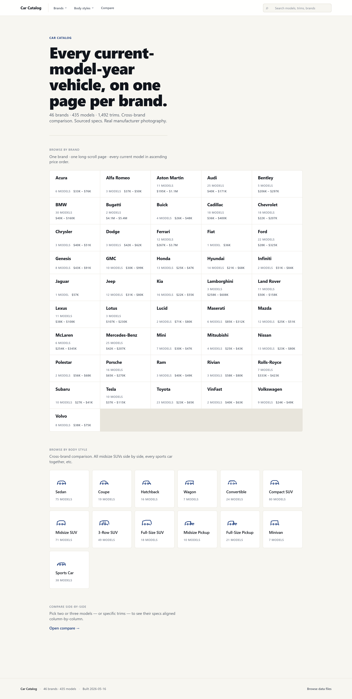
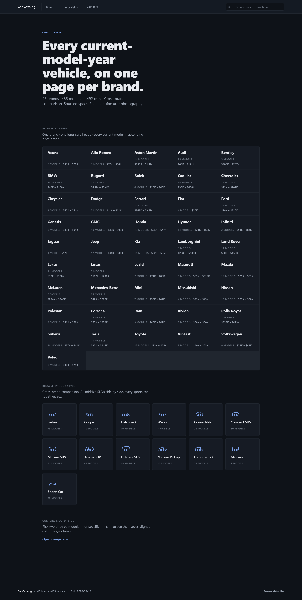
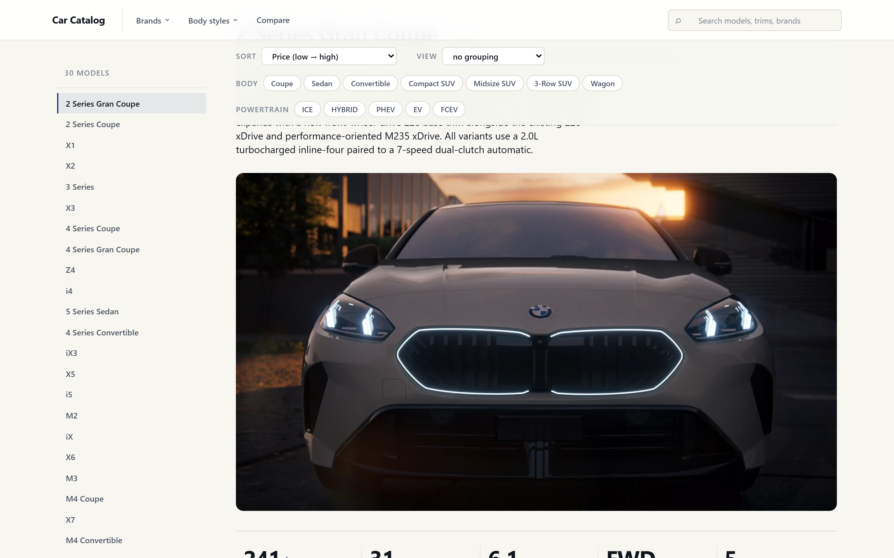
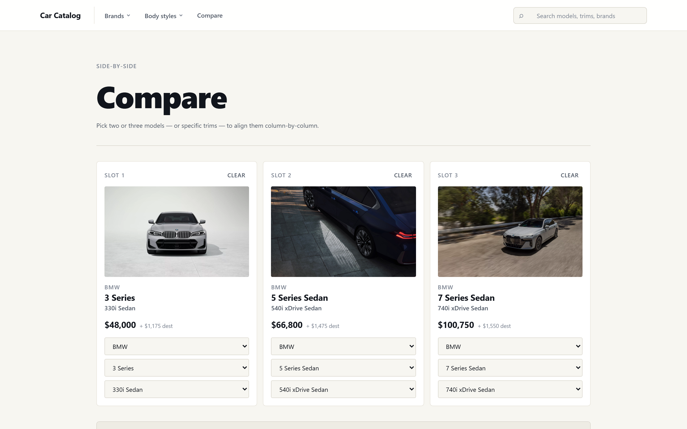
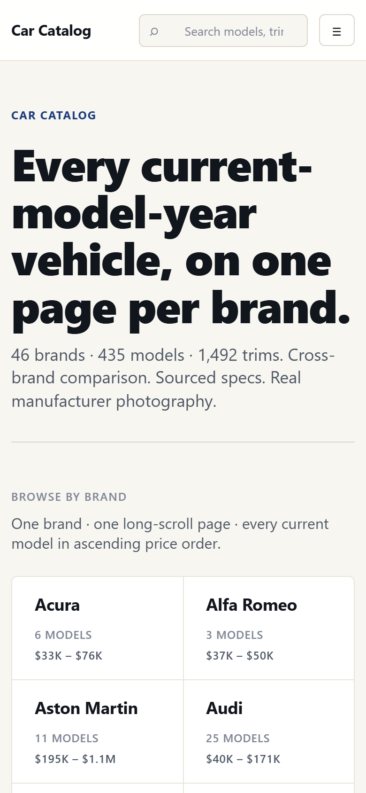
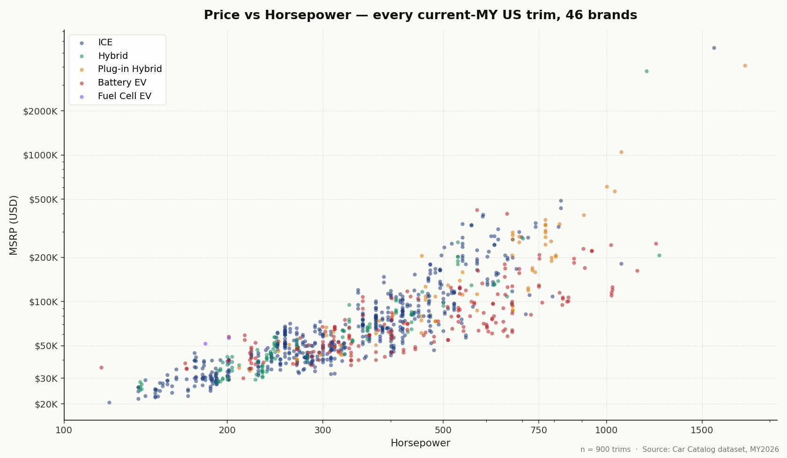

# Car Catalog

A structured dataset and browsable static site covering every current-model-year vehicle from 46 brands sold new in the US — 435 models, 1,492 trims, every field source-cited, fully offline-capable.

**Live demo:** [nadeaujonny.github.io/car-catalog](https://nadeaujonny.github.io/car-catalog/) *(deploys from `main` via GitHub Actions; see [Phase 5 deploy notes](#deploy))*
**Repo:** [github.com/nadeaujonny/car-catalog](https://github.com/nadeaujonny/car-catalog)
**License:** [MIT](./LICENSE)



---

## What this is

The dataset is the asset. `data/<brand>.json` (×46) is a hand-built, source-cited, schema-versioned catalog of every model year 2026 car sold new in the United States — manufacturer-only sourcing for specs (with documented scoped relaxations for MSRP and image fallbacks); every field carrying its citation; verification rules encoded as scripts; the schema evolving v1.0 → v1.1 → v1.2 → v1.3 over the course of the project as edge cases surfaced.

The catalog site at `catalog/index.html` is a vanilla-JS / vanilla-CSS / no-build single-page app that renders the dataset directly from the brand JSONs. It works fully offline (`file://` opens the site; no server required), and it works fully online (GitHub Pages serves the same files). There are no frameworks, no bundlers, no transpilers, no toolchain — just `<script src="app.js" defer>` reading `manifest.json`.

The project was built via Claude Code orchestration: I designed and ran 16 chained AI-driven engineering sessions, each with an explicit session brief, named safety rules, mid-session checkpoints, and verification gates. The session-summary discipline (every session writing a per-phase outcomes report) is what made it possible to scale across 46 brands without losing coherence. The engineering narrative — what worked, what failed, what got reverted, what the verification system caught — is in [docs/PROCESS.md](./docs/PROCESS.md).

---

## At a glance

| | |
|---|---|
| **Brands covered** | 46 |
| **Models** | 435 |
| **Trims** | 1,492 |
| **Spec fields per row** | ~40 (MSRP, drivetrain, MPG/MPGe, dimensions, safety, reliability, warranty, features) |
| **Source citations** | Every field, by source URL |
| **Image coverage** | 3,253 / 4,482 = **72.58%** (manufacturer-sourced; the 27% gap is documented structural ceiling) |
| **MSRP completion** | **~98%** (the 2% gap is ultra-luxury non-disclosure — Bentley, McLaren, Aston Martin, Rolls-Royce, Ferrari) |
| **Reliability data** | JD Power 2026 VDS, current per model |
| **Verification blockers** | **0** across all 46 brands |
| **Offline-capable** | Yes — `file://` opens the site |
| **Build toolchain** | None |
| **Engineering sessions** | 16 chained Claude Code sessions |

---

## Screenshots

### Homepage — light mode


### Homepage — dark mode


### Brand view (BMW)


### Compare view — three models side by side


### Mobile


---

## What's interesting about this project

These are the parts of the work that are worth a second look:

### Source-provenance discipline

Every spec field in every brand JSON carries its citation: `{ "value": 35.5, "source": "https://www.bmwusa.com/vehicles/.../specifications.html", "source_confidence": "high" }`. The verification scripts (`scripts/verify_brand.mjs`) enforce a forbidden-source list — `cars.com`, `motor1.com`, `carbuzz.com`, `autoblog.com`, `autoevolution.com`, dealer sites, content farms — and any blocker fails the brand. Session 11 ran a forbidden-source fix-pass across the original 4-brand cohort and eliminated 215 prior citations (project blockers 271 → 56 = -79%).

### Schema-versioned data with documented evolution

`schema_version: 1.0 → 1.1 → 1.2 → 1.3` over the project. v1.1 added the singleton-trim rule (every sole-trim of a model carries the full spec, no delta). v1.2 added the EV `customer_satisfaction` mirroring rule (JD Power APEAL is reported per-MY but not always per-trim). v1.3 added `behind_3rd_row` cargo for three-row SUVs, the NHTSA/IIHS roll-up URL convention, ultra-luxury MSRP non-disclosure handling, and the optional `sources_confidence` map. Every revision is documented in `instructions/00_master_spec.md` and traceable through the session summaries.

### Verification system caught (and reverted) external anti-bot poisoning

In Session 15, the image scraping pipeline downloaded what looked like 4 valid JPEGs from a Tier 2 source (NetCarShow) — proper JFIF headers, realistic file sizes, correct content-type. The brief required a visual spot-check before promoting Tier 2 fills to project-wide. Visual inspection caught that all 4 were anti-bot pixel-noise decoys (the source serves decoys to non-browser clients). The session HALTed at the checkpoint, the 4 image entries were reverted, the 4 decoy files were deleted, and Tier 2 was demoted to "dormant pending fetch-mechanism upgrade." The verification gate prevented project-wide propagation of bad data. See `SESSION_SUMMARY_15.md` and `reports/session15_final.md` for the full account.

### Honest accounting of limitations

The project does not pretend coverage problems away. Tesla is at 0% image coverage because tesla.com all-page and the configurator API both return HTTP 403 to any non-browser client — the catalog renders Tesla models with placeholder fallbacks and the limitation is documented. 27% of overall images are missing for similar structural reasons (manufacturer CDNs that gate, or that don't publish images for every trim variant). The catalog is honest about this — empty image entries render placeholders, not stale or substituted content. The "structural ceiling" concept emerged in Session 8 and is now baked into the project's coverage reporting.

### Tiered source policy with documented scope

Manufacturer-only (Tier 1) is the default. Two relaxations are scoped and documented: (a) `instructions/01_research_brand.md` §4.6 permits automotive-press editorial sources for MSRP on ultra-luxury brands where manufacturers do not publish prices (Bentley, McLaren, Aston Martin, etc.); (b) `instructions/04_scrape_images.md` §A permits a small allowlist of press-kit aggregators as Tier 2 image sources, with provenance fields (`source_tier`, `source_domain`) recorded on each image entry. Tier 2 is currently dormant pending the anti-bot finding from Session 15 — but the architecture is in place.

### Catching script bugs via cross-brand pattern detection

Session 9's per-brand image investigation found a regex separator bug in `pickBestForAngle` that had been silently underperforming on multiple brands. The Kia investigation that surfaced it gained Kia +45.3 percentage points of image coverage after the fix. Two later sessions found similar latent bugs (HTML entity decoding; Referer header gating). The "test the diagnosis" heuristic in `instructions/05_session_runbook.md` §8 came directly from those findings.

---

## Example analyses

Three example data analyses are in [`analyses/`](./analyses/), demonstrating what the dataset enables. Each is a standalone Python script (matplotlib only) that reads `data/<brand>.json` directly — no API, no DB. See [`analyses/README.md`](./analyses/README.md) for the full writeup.



- **Price–Performance Landscape** — MSRP vs horsepower across 900 trims, colored by powertrain. Surfaces value tiers, performance outliers (the Bugatti Tourbillon at 1800 hp / $4.1M), and powertrain segmentation (PHEVs cluster in the luxury-performance tier at $120K+).
- **Brand Reliability Map** — JD Power 2026 VDS by brand against the industry average. Real findings: Lexus #1 premium at 151 PP100; Buick #1 mass-market at 160; Volkswagen last at 301. ([chart](./analyses/charts/reliability_map.png))
- **EV Market Snapshot** — range vs price for 185 EV trims, DC fast-charging speed as bubble size. Lucid Air leads the range frontier (512 mi); Tesla Model 3/Y dominate under-$50K range-per-dollar; BMW iX3, Lucid Gravity, Porsche Cayenne Electric peak at 400 kW charging. ([chart](./analyses/charts/ev_market.png))

---

## Tech stack

| Layer | Choice |
|---|---|
| Frontend | Vanilla JS (ES2020+, no framework) |
| Styling | Vanilla CSS with custom properties; light + dark mode via `prefers-color-scheme` |
| Data format | One JSON per brand, fetched at runtime |
| Build tools | None — no bundler, transpiler, or task runner |
| Image scraping | Node.js scripts in `scripts/`; Playwright as JS-rendering fallback |
| Verification | Node.js scripts (`verify_brand.mjs`); structural rules encoded |
| Analyses | Python 3 + matplotlib (only for `analyses/`; the catalog itself has no Python runtime) |
| Hosting | GitHub Pages via GitHub Actions (`.github/workflows/deploy.yml`) |

The "no build tools, no backend, opens by double-clicking index.html" property is deliberate. The site has the same UX online as offline, and the dataset is portable: anyone can fork the repo and read `data/honda.json` directly without standing up a backend.

---

## How to view locally

The catalog works in three ways:

**1. Double-click `catalog/index.html`** in File Explorer.

The site opens in your default browser. Works entirely offline. The browser may print a console warning about `fetch()` from `file://` for the JSON files — this is fine; modern browsers handle it.

**2. Serve `catalog/` over HTTP** (recommended for development):

```bash
cd catalog
python -m http.server 8000
# then open http://localhost:8000
```

Or use any other static server (`npx serve`, `caddy file-server`, etc.).

**3. View the live deploy** at the URL above.

---

## Repo structure

```
car-catalog/
├── README.md                    you are here
├── LICENSE                      MIT, Jonathan Nadeau, 2026
├── catalog/                     the static site
│   ├── index.html
│   ├── styles.css               (~54 KB, hand-written, no preprocessor)
│   ├── app.js                   (~77 KB, vanilla JS)
│   ├── manifest.json            (lists the 46 brands)
│   ├── data/                    (per-brand JSONs the site fetches at runtime)
│   └── images/                  (catalog/<brand>/<model>/<trim_family>/*.jpg)
├── data/                        (canonical brand JSONs; catalog/data/ mirrors these)
├── instructions/                (the project's process documentation)
│   ├── 00_master_spec.md        (schema; the contract)
│   ├── 01_research_brand.md     (Phase 1 workflow: research a brand)
│   ├── 02_build_catalog.md      (Phase 2: build the site)
│   ├── 03_verify_catalog.md     (Phase 3: verification rules)
│   ├── 04_scrape_images.md      (Phase 4: image pipeline + tiered sources)
│   ├── 05_session_runbook.md    (meta-rules for multi-phase sessions)
│   └── 06_maintenance.md        (periodic upkeep workflows)
├── scripts/                     (Node.js + Python scripts)
│   ├── scrape_image_urls.mjs    (production image scraper)
│   ├── download_images.mjs      (production image downloader)
│   ├── verify_brand.mjs         (verification rules → blockers/warnings/FYIs)
│   ├── brand-configs/           (per-brand scraping hints)
│   └── diag_*.mjs               (per-brand diagnostic harnesses from Sessions 5–9)
├── analyses/                    (example dataset analyses with charts)
├── reports/                     (per-brand verification reports + per-session logs)
├── docs/                        (portfolio documentation)
│   ├── PROCESS.md               (the engineering narrative)
│   ├── SCHEMA.md                (dataset structure guide)
│   ├── PROJECT_SPEC.md          (the original project specification, preserved)
│   └── screenshots/             (the images embedded in this README)
├── PROJECT_STATE.md             (pointer file for picking up the project mid-stream)
├── SESSION_NOTES.md             (append-only halt + decision log across all 16 sessions)
├── SESSION_SUMMARY_*.md         (one per session — the engineering record)
├── STATUS.md                    (per-brand pipeline status)
└── .github/workflows/deploy.yml (GitHub Pages deploy on push to main)
```

---

## A note on the AI-driven workflow

This project was built end-to-end via Claude Code orchestration over 16 chained sessions. I want to be specific about what that means:

- **Each session had an explicit brief** — a multi-section prompt covering scope, phase structure, safety rules, expected outcomes, and explicit checkpoints. The briefs are not stored verbatim, but their structure is reflected in `instructions/05_session_runbook.md` and in the per-session SESSION_SUMMARY files.
- **Each session produced inspectable artifacts** — JSON diffs, verification reports, session summaries, and (when relevant) detailed reports in `reports/`. This is the discipline that scaled: when a session went sideways (Session 5's Toyota destruction event; Session 15's NetCarShow decoy finding) the artifacts made the failure visible and the rollback decidable.
- **My role was design and orchestration:** writing the briefs, choosing the phase ordering, making policy decisions (e.g., "manufacturer-only for spec sources, scoped relaxation for MSRP on ultra-luxury"), and reviewing the outputs. Not every output was correct on first pass — the verification system caught real errors, including the anti-bot decoy that Session 15 halted on.
- **The tradeoffs are real.** AI orchestration trades a particular kind of speed and breadth for the need to verify rigorously at every step. The session-summary discipline and the gated checkpoints are how the project absorbed that tradeoff. The engineering record is in the [PROCESS.md](./docs/PROCESS.md) and is honest about what worked and what didn't.

It's worth noting too: no part of the catalog code or dataset shipped without explicit review at a checkpoint. The MIT license and the dataset's verification cleanliness mean anyone forking this repo gets a project they can actually audit — every spec field traces back to a source URL, every session traces back to a SESSION_SUMMARY, and every halt traces back to a SESSION_NOTES entry.

---

## Deploy

The site deploys to GitHub Pages automatically via [`.github/workflows/deploy.yml`](./.github/workflows/deploy.yml) on every push to `main`. The workflow uploads `catalog/` as the Pages artifact; first-time setup requires enabling Pages in repo Settings → Pages with "GitHub Actions" as the source.

**Manual run locally** (matches what the workflow does):

```bash
cd catalog
python -m http.server 8000
```

---

## Built by

**Jonathan Nadeau** — [github.com/nadeaujonny](https://github.com/nadeaujonny)

Built 2026-05-11 through 2026-05-16 across 16 Claude Code sessions. The session-by-session record is in [`SESSION_SUMMARY_*.md`](./).

---

## License

[MIT](./LICENSE), copyright Jonathan Nadeau, 2026.

The MIT license covers the catalog code, schema, JSON dataset structure, and original prose. Image files in `catalog/images/` are manufacturer press-kit photography sourced from each automaker's official media site under fair-use editorial / portfolio-demonstration context — copyright in those images remains with the respective manufacturer. Anyone forking or redistributing this repo for purposes beyond personal study should review the source manufacturers' image-use terms independently.
