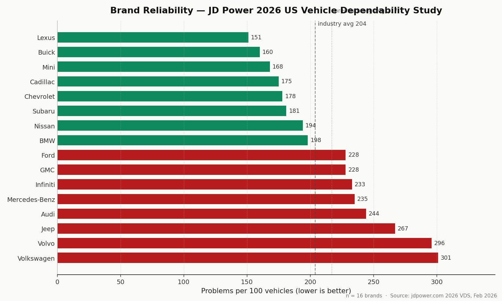
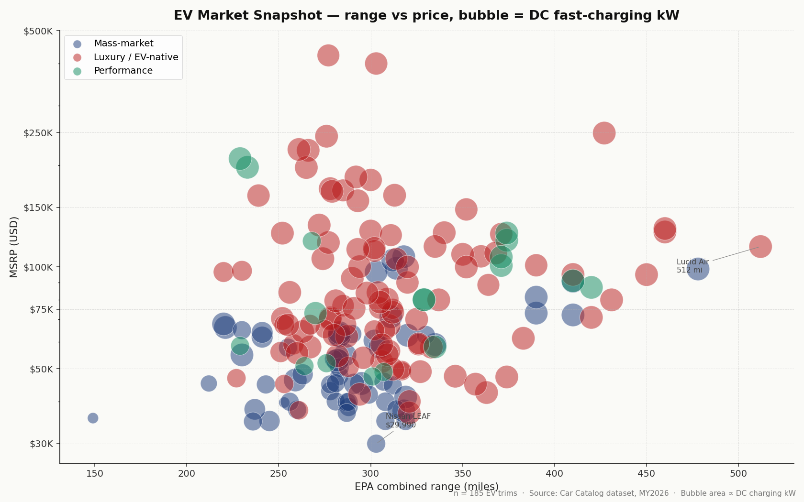

# Analyses

Three example dataset analyses that demonstrate what the catalog dataset enables. Each script reads `data/<brand>.json` directly (no API, no DB) and produces a chart + a markdown summary. Charts are saved to `analyses/charts/`.

These are demonstrative, not exhaustive. The point is to show that the dataset is structured enough to support real cross-brand analysis with ~20 lines of plumbing.

---

## Running the analyses

Requires Python 3.10+ and `matplotlib`. Run from the project root:

```bash
python analyses/price_performance.py
python analyses/brand_reliability.py
python analyses/ev_market.py
```

Each script prints its findings to stdout (markdown-formatted, suitable for piping to a file) and saves a PNG to `analyses/charts/`. No other dependencies.

---

## 1. Price–Performance Landscape


**Script:** [`price_performance.py`](./price_performance.py)

**What it shows:** MSRP (log) vs horsepower (log) for every current-MY trim across the 46 brands in the dataset, colored by powertrain type (ICE, hybrid, plug-in hybrid, battery EV, fuel cell EV).

**Sample findings from the latest run (900 trims plotted):**

- **Powertrain distribution by trim:** 539 ICE / 106 Hybrid / 66 PHEV / 187 EV / 2 FCEV. EVs are the second-largest powertrain category and skew higher in both price and power (median EV trim: 435 hp / $66,200; median ICE trim: 312 hp / $55,600).
- **PHEVs are concentrated in luxury performance:** median PHEV trim is 577 hp at $121,700. These are Porsche Cayenne S E-Hybrid / Panamera Turbo S E-Hybrid territory, not affordable plug-ins.
- **Top 5 value trims (lowest $/hp):** Rivian R2 Performance Launch Edition ($88/hp), Dodge Charger Daytona Scat Pack ($93/hp), Ford Mustang GT Fastback ($97/hp), Chevrolet Silverado EV LT ($98/hp). EVs and American performance dominate the value frontier.
- **Top 5 HP outliers:** Bugatti Tourbillon (1800 hp / $4.1M), Bugatti W16 Mistral (1578 hp / $5.4M), Chevrolet Corvette ZR1X (1250 hp / $207K), Lucid Air Sapphire (1234 hp / $249K), Ferrari F80 (1184 hp / $3.7M).

The chart's log-log scaling spans roughly 4 orders of magnitude on the y-axis ($20K to $5M+); the diagonal trend is the price-per-horsepower frontier.

---

## 2. Brand Reliability Map



**Script:** [`brand_reliability.py`](./brand_reliability.py)

**What it shows:** Horizontal bar chart of JD Power 2026 US Vehicle Dependability Study (VDS) scores by brand, sorted best-to-worst. Lower is better (PP100 = problems per 100 vehicles). Industry average (204 PP100) and premium-segment average (217 PP100) are overlaid.

**Sample findings from the latest run (16 brands with reported VDS):**

- **Best 5 (most dependable):** Lexus 151, Buick 160, Mini 168, Cadillac 175, Chevrolet 178. Lexus has now led premium dependability for 4 consecutive years. Buick is the highest-ranked mass-market brand.
- **Worst 5:** Volkswagen 301, Volvo 296, Jeep 267, Audi 244, Mercedes-Benz 235. The German premium brands (Audi, MB) sit above premium-segment average; VW + Volvo are deep outliers.
- **Distribution:** 8 brands at or below industry average; 8 above. A clean split.

**Coverage caveat:** 30 of the 46 brands in the dataset have null `jd_power_vds_score`. These are typically EV-only marques (Lucid, Rivian, Polestar, Tesla — note: Tesla *is* covered by JD Power but isn't part of the publicly-released brand ranking because it doesn't authorize state-level access to its data), niche / low-volume brands (Aston Martin, Bentley, McLaren, Pagani-class exotics), and a handful of mainstream brands whose 2026 VDS scores aren't in the published press release. The chart reflects what's available, not the full market.

---

## 3. EV Market Snapshot



**Script:** [`ev_market.py`](./ev_market.py)

**What it shows:** Scatter of EPA combined range (x) vs MSRP (y, log scale) for every battery-EV trim in the dataset. Bubble size is proportional to DC fast-charging peak kW. Color-coded by brand positioning (mass-market, luxury / EV-native, performance, exotic).

**Sample findings from the latest run (185 EV trims plotted):**

- **Longest range:** Lucid Air Grand Touring 512 mi @ $114,900. Lucid Gravity Grand Touring 450 mi @ $94,900. The Lucid Air remains the EPA-range leader in the US market by a comfortable margin.
- **Best value under $50K:** Mercedes-Benz CLA 250+ with EQ Technology (374 mi @ $47,250 — a notable entry, this is the new EV CLA platform), Tesla Model 3 Premium RWD (363 mi @ $42,490), Tesla Model Y Long Range RWD (357 mi @ $44,990). Tesla still dominates the under-$50K range-per-dollar quadrant.
- **Fastest DC charging:** BMW iX3 50 xDrive, Lucid Gravity GT, and three Porsche Cayenne Electric trims all peak at 400 kW DC. These represent the current state-of-art for production EV charging speeds (800V architectures).

The chart surfaces real market structure: Tesla packs the high-value zone of the under-$50K / 300+ mi quadrant; Lucid pushes the range frontier; the luxury German brands (BMW, Porsche, Mercedes) compete on charging speed and chassis at the $80K–$160K tier; Cadillac Escalade IQ and GMC Sierra EV demonstrate the full-size truck/SUV EV segment.

---

## How the analyses use the dataset

Each script is ~150 lines of Python and follows the same pattern:

1. **Load brand JSONs.** `glob` for `data/*.json`, filter out `_partials` and `.bak`, parse each with `json.load`.
2. **Walk the model → trim hierarchy.** Each brand JSON has `brand.models[].trims[]`. Each trim has full specs in nested objects (powertrain, performance, dimensions, etc.).
3. **Apply a filter.** For the price-performance chart: trims with both `msrp_base` and `powertrain.horsepower_hp`. For reliability: brands with non-null `reliability.jd_power_vds_score`. For EVs: trims where `powertrain.type == "ev"` with `ev_specifics.electric_range_mi` and `msrp_base` populated.
4. **Plot with matplotlib.** No styling preprocessor, no theme system — just `figsize`, `dpi`, manual color palette matching the catalog's accent (`#1a3a7a` indigo + four supporting colors).
5. **Save PNG, print findings.** Each script writes its chart and prints a markdown summary so the output is portfolio-pasteable.

Total dependency footprint: `matplotlib` only. Total Python in this directory: ~600 lines. Total time to run all three: under 5 seconds on a typical laptop.

---

## What else you could do with this dataset

Some ideas the dataset would support without additional research work:

- **Cargo-volume by body style.** `dimensions.cargo_volume_cuft` is populated per trim; cross-tab with `body_style`.
- **Drivetrain availability matrix.** `powertrain.drivetrain` (FWD/RWD/AWD/4WD) × `body_style` × brand.
- **ADAS standardization timeline.** `safety.standard_adas.*` booleans by brand show how widely each feature is now standard.
- **Warranty positioning.** `warranty.basic_yr_mi` / `powertrain_yr_mi` / `ev_battery_yr_mi` by brand and price tier.
- **Hybrid efficiency vs ICE.** For models with both powertrain options, the hybrid premium and combined-mpg delta.
- **Trim-table depth.** Count of trims per model by brand — measures how much choice each brand offers.
- **Source-confidence audit.** `sources_confidence` (optional, schema v1.3) flags where editorial sources were used vs. manufacturer-primary.

All of these are 30–50 lines of Python following the same load → filter → plot pattern.
